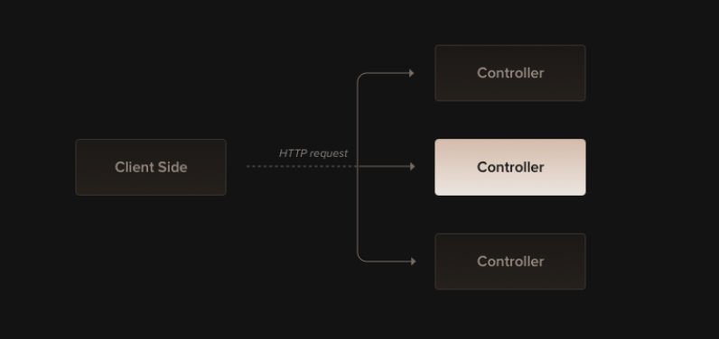

# Controllers in NestJS

Controllers are responsible for handling **incoming HTTP requests** and returning **responses** to the client. In NestJS, controllers are just classes, but with the help of **decorators**, they define a routing mechanism that maps each request to a specific function (method) in the class.



---

## Purpose of a Controller

* Handle specific routes or groups of routes (like `/cats`, `/users`, etc.)
* Map HTTP methods (`GET`, `POST`, `PUT`, `DELETE`, etc.) to controller methods
* Send appropriate HTTP responses, such as JSON, strings, or custom status codes

---

## Creating a Controller

You can generate a controller using the CLI:

```bash
$ nest g controller cats
```

This will create a controller like the following:

```ts
import {
  Controller,
  Get,
  Post,
  Put,
  Param,
  HttpCode,
  Header,
  Redirect,
  Query,
} from '@nestjs/common';

@Controller('cats')
export class CatsController {
  @Get()
  findAll(): string {
    return 'This action returns all cats';
  }

  @Post()
  @HttpCode(201)
  @Header('Cache-Control', 'no-store')
  create(): string {
    return 'This action adds a new cat';
  }

  @Put(':id')
  update(@Param('id') id: string): string {
    return `This action updates cat ${id}`;
  }

  @Get('docs')
  @Redirect('https://docs.nestjs.com', 302)
  getDocs(@Query('version') version?: string) {
    if (version === '5') {
      return { url: 'https://docs.nestjs.com/v5/' };
    }
  }

  @Get('wildcard/*')
  wildcard(): string {
    return 'This route uses a wildcard';
  }
}
```

---

## Route Structure

NestJS builds route paths using:

* The path in `@Controller('cats')`
* The sub-path in method decorators like `@Get('breed')`

### Example

```ts
@Controller('cats')
export class CatsController {
  @Get('breed')
  getBreed(): string {
    return 'GET /cats/breed';
  }
}
```

---

## Route Parameters

Dynamic segments can be defined using `:` and accessed via the `@Param()` decorator.

```ts
@Get(':id')
findOne(@Param('id') id: string): string {
  return `This returns cat with id ${id}`;
}
```

---

## 🪄 Wildcard Routes

You can use wildcards like `*` in your route path:

```ts
@Get('abc/*')
wildRoute(): string {
  return 'Matched abc/* route';
}
```

---

## 🎯 Status Codes & Headers

Customize status codes or headers using:

* `@HttpCode(204)` — changes HTTP response code
* `@Header('Cache-Control', 'no-store')` — adds custom headers

---

## 🔁 Redirection

Use `@Redirect()` to redirect to another URL:

```ts
@Get('docs')
@Redirect('https://docs.nestjs.com', 302)
getDocs() {}
```

Dynamic redirect:

```ts
@Get('docs')
@Redirect()
getDocs(@Query('version') version: string) {
  if (version === '5') {
    return { url: 'https://docs.nestjs.com/v5/' };
  }
  return { url: 'https://docs.nestjs.com' };
}
```

---

## 🧾 Request Object (Advanced)

To access raw request data:

```ts
import { Request } from 'express';

@Get()
findAll(@Req() request: Request): string {
  return `Request from IP: ${request.ip}`;
}
```

Use `@Body()`, `@Query()`, `@Param()`, etc., for easier access to parts of the request.

---

## 🌐 Sub-domain Routing

Example usage
- Role based access control.


You can handle subdomains using the `@Controller({ host: ... })` decorator:

```ts
@Controller({ host: 'admin.example.com' })
export class AdminController {
  @Get()
  index(): string {
    return 'Admin page';
  }
}
```

Dynamic subdomains are also supported:

```ts
@Controller({ host: ':account.example.com' })
export class AccountController {
  @Get()
  getInfo(@HostParam('account') account: string) {
    return account;
  }
}
```

---

## ⚡ Async Support

Nest supports both Promises:

```ts
@Get()
async findAll(): Promise<any[]> {
  return [];
}
```

---

## 🧩 Handling Payloads with DTOs

Use classes to define DTOs:

```ts
// create-cat.dto.ts
export class CreateCatDto {
  name: string;
  age: number;
  breed: string;
}
```

Use it in the controller:

```ts
@Post()
async create(@Body() createCatDto: CreateCatDto) {
  return 'This action adds a new cat';
}
```

Use `ValidationPipe` to whitelist properties:

```ts
app.useGlobalPipes(
  new ValidationPipe({ whitelist: true }),
);
```

---

## 🧮 Query Parameters

Basic query param usage:

```ts
@Get()
findAll(@Query('age') age: number, @Query('breed') breed: string) {
  return `Filtered by age: ${age}, breed: ${breed}`;
}
```

For complex queries, configure the parser:

### Express:

```ts
const app = await NestFactory.create<NestExpressApplication>(AppModule);
app.set('query parser', 'extended');
```

### Fastify:

```ts
const app = await NestFactory.create<NestFastifyApplication>(
  AppModule,
  new FastifyAdapter({
    querystringParser: (str) => qs.parse(str),
  }),
);
```

---

```ts
import {
  Controller,
  Get,
  Query,
  Post,
  Body,
  Put,
  Param,
  Delete,
} from '@nestjs/common';
import { CreateCatDto, UpdateCatDto, ListAllEntities } from './dto';

@Controller('cats')
export class CatsController {
  @Post()
  create(@Body() createCatDto: CreateCatDto) {
    return 'This action adds a new cat';
  }

  @Get()
  findAll(@Query() query: ListAllEntities) {
    return `This action returns all cats (limit: ${query.limit} items)`;
  }

  @Get(':id')
  findOne(@Param('id') id: string) {
    return `This action returns a #${id} cat`;
  }

  @Put(':id')
  update(@Param('id') id: string, @Body() updateCatDto: UpdateCatDto) {
    return `This action updates a #${id} cat`;
  }

  @Delete(':id')
  remove(@Param('id') id: string) {
    return `This action removes a #${id} cat`;
  }
}
```

Use CLI to scaffold this:

```bash
nest g controller cats
```

---

## ⚙️ Library-Specific Response Handling

You can inject `@Res()` to use Express’ response object:

```ts
import { Controller, Get, Post, Res, HttpStatus } from '@nestjs/common';
import { Response } from 'express';

@Controller('cats')
export class CatsController {
  @Post()
  create(@Res() res: Response) {
    res.status(HttpStatus.CREATED).send();
  }

  @Get()
  findAll(@Res() res: Response) {
    res.status(HttpStatus.OK).json([]);
  }
}
```

Use passthrough mode to mix native and Nest behavior:

```ts
@Get()
findAll(@Res({ passthrough: true }) res: Response) {
  res.status(HttpStatus.OK);
  return [];
}
```